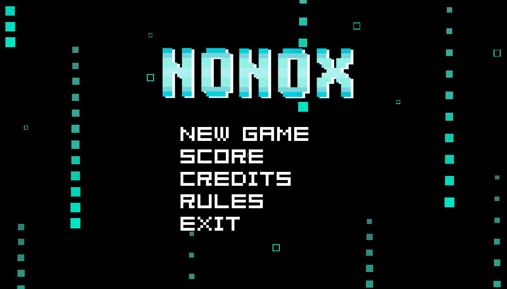

# Nonox

**Nonox** es un proyecto desarrollado en el marco de la materia **Laboratorio de Computación 2** de la [Tecnicatura Universitaria en programación (UTN)](https://www.frgp.utn.edu.ar/carreras/tup_tuss). Desarrollado por Guada Juricich y [Alejandro Morales](https://github.com/AlejandroDanielMorales). Este proyecto es un juego de tipo rompecabezas que consiste en descubrir una imagen oculta en una cuadrícula usando la lógica. El desarrollo de **Nonox** se llevó a cabo utilizando **Visual Studio Code**, y las tecnologías empleadas fueron **C++**, **CSS** y **SFML**.

## Características

- **Tres tableros.**
- **Ranking de puntaje**
- **Power apps.**

## ¿Cómo utilizar Nonox?

Para ejecutar este proyecto:

- Cloná el repositorio.
- Para compilar utilizar la configuración: -std=c++17 -lsfml-graphics -lsfml-window -lsfml-system.

## Para saber más

El diseño y desarrollo de Nonox se encuentra detallado en este [informe](https://es.overleaf.com/read/pqnpxrrrrsvz#60d51f) donde podrá acceder:

1. Sinopsis del juego.
2. Objetivo.
3. Mecánica del juego.
4. Power Ups.
5. Puntaje.
6. Controles.
7. Diagrama de clases.
8. Referencias.

## Licencia 
Code copyright 2024 Guada Juricich - Alejandro Morales.
